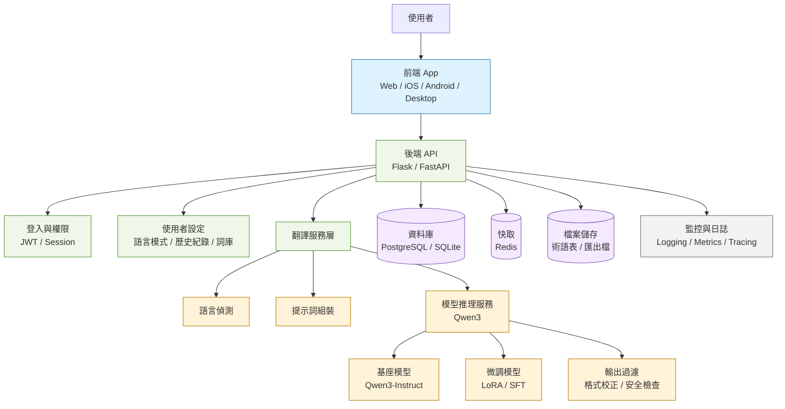

# 🏗️ AI Language Bridge 系統架構

## 整體架構圖

```
┌─────────────────────────────────────────────────────────────────┐
│                         LINE 用戶                                │
└────────────────┬────────────────────────────────────────────────┘
                 │
                 ▼
┌─────────────────────────────────────────────────────────────────┐
│                      LINE Platform                              │
│              (Messaging API, Webhook Events)                    │
└────────────────┬────────────────────────────────────────────────┘
                 │
        ┌─────────▼──────────┐
        │  HTTPS Webhook     │
        │   (Signature       │
        │   Verification)    │
        └─────────┬──────────┘
                 │
┌────────────────▼──────────────────────────────────────────────┐
│                    Flask Application                          │
│  (app/factory.py → app/factory.py → create_app())            │
│                                                               │
│  ┌──────────────────────────────────────────────────────┐   │
│  │ Routes & Blueprints                                  │   │
│  │ - /webhook (LINE Webhook)                            │   │
│  │ - /health (Health Check)                             │   │
│  │ - /info (App Info)                                   │   │
│  └──────────────────────────────────────────────────────┘   │
└────────────────┬──────────────────────────────────────────────┘
                 │
        ┌────────▼────────┐
        │  LINE Handler   │
        │ (src/line_bot/) │
        └────────┬────────┘
                 │
    ┌────────────┼────────────┐
    │            │            │
    ▼            ▼            ▼
┌──────────┐ ┌────────┐ ┌──────────────┐
│ Parse    │ │Extract │ │ Detect       │
│ Webhook  │ │ Text   │ │ Language     │
│ Signature│ │ & User │ │ (Optional)   │
└────┬─────┘ └───┬────┘ └────────┬─────┘
     │           │              │
     └───────────┼──────────────┘
                 │
                 ▼
           ┌────────────────┐
           │ Build Request  │
           │ (TranslationRq)│
           └────────┬───────┘
                    │
        ┌───────────▼──────────────┐
        │  Translator Module       │
        │ (src/translator/)        │
        │                          │
        │ ┌────────────────────┐   │
        │ │ GeminiTranslator   │   │
        │ │                    │   │
        │ │ - Call Gemini API  │   │
        │ │ - Error Handling   │   │
        │ │ - Response Format  │   │
        │ └────────┬───────────┘   │
        │          │               │
        │          ▼               │
        │ ┌────────────────────┐   │
        │ │ LanguageDetector   │   │
        │ │ (langdetect lib)   │   │
        │ └────────────────────┘   │
        └────────┬──────────────────┘
                 │
                 ▼
        ┌─────────────────────┐
        │   Google Gemini     │
        │   (AI Translator)   │
        │                     │
        │ gemini-1.5-flash    │
        └─────────┬───────────┘
                 │
    ┌────────────▼────────────┐
    │  Translated Response    │
    │ (TranslationResponse)   │
    └────────────┬────────────┘
                 │
        ┌────────▼──────────┐
        │  Format Message   │
        │  Based on Mode    │
        │  (ja/en/multi)    │
        └────────┬──────────┘
                 │
        ┌────────▼──────────┐
        │ Quick Reply Menu  │
        │ (Optional)        │
        └────────┬──────────┘
                 │
        ┌────────▼──────────┐
        │ Send via LINE API │
        └────────┬──────────┘
                 │
                 ▼
        ┌─────────────────────┐
        │  LINE User's Chat   │
        │  (Translated Text)  │
        └─────────────────────┘
```

## 層級架構

### 🔧 基礎層 (Base Layer)
- **配置管理** (`src/config.py`)
- **常數定義** (`src/constants.py`)
- **數據模型** (`src/models/`)

### 🛠️ 工具層 (Utilities Layer)
- **日誌管理** (`src/utils.setup_logging()`)
- **文本格式化** (`src/utils.format_message()`)
- **語言解析** (`src/utils.parse_language_code()`)

### 🌉 集成層 (Integration Layer)
- **LINE Bot 連接** (`src/line_bot/handler.py`)
- **Webhook 驗證** → 簽名檢查
- **事件解析** → MessageEvent 處理

### 🔄 業務邏輯層 (Business Logic Layer)
- **翻譯服務** (`src/translator/gemini_translator.py`)
- **語言檢測** (`src/translator/language_detector.py`)
- **模式管理** → 用戶偏好 (ja/en/multi)

### 🎯 應用層 (Application Layer)
- **Flask 應用工廠** (`app/factory.py`)
- **路由和端點** (health, info, webhook)
- **中間件** (日韓、CORS 等)

## 數據流

### 1. 用戶消息接收流程

```python
LINE 消息 
→ app/factory.py (Flask app)
→ src/line_bot/handler.py (webhook 藍圖)
→ 驗證簽名 (WebhookHandler.handle)
→ 提取 TextMessage
→ 解析 user_id, reply_token
```

### 2. 翻譯請求處理流程

```python
TextMessage
→ TranslationRequest (src/models.TranslationRequest)
→ GeminiTranslator.translate()
  ├─ LanguageDetector.detect() (檢測源語言)
  ├─ 調用 Gemini API
  └─ 返回 TranslationResponse
→ 格式化消息 (format_translation_message)
→ 構建回復 (TextSendMessage + QuickReply)
```

### 3. 回復發送流程

```python
TextSendMessage + QuickReply
→ LineBotApi.reply_message()
→ LINE Platform (HTTPS API)
→ 用戶收到消息
```

## 核心模塊互動

```
┌─────────────────────────────────────────────────┐
│         app/factory.py                          │
│    (Flask 應用工廠 & 入口)                      │
└───────────────┬─────────────────────────────────┘
                │
    ┌───────────┴───────────┐
    │                       │
    ▼                       ▼
┌──────────────┐    ┌──────────────────┐
│   src/line_bot/      src/translator/  │
│   handler.py     gemini_translator.py │
│                                       │
│ • Webhook 接收     • Gemini API 調用  │
│ • 簽名驗證         • 翻譯邏輯         │
│ • 事件解析         • 結果驗證         │
└───┬──────────┘    └──────┬───────────┘
    │                      │
    └──────────┬───────────┘
               │
        ┌──────▼──────┐
        │ src/models/ │
        │ • 數據結構  │
        │ • 類型定義  │
        └──┬───────┬──┘
           │       │
    ┌──────▼──┐ ┌──▼─────────┐
    │src/const│ │src/utils/  │
    │ants.py  │ │ • 工具函數 │
    └─────────┘ └────────────┘
```

## 用戶状態管理

```python
# 全局默認字典
user_prefs = {
    "user_id_1": "ja",      # 日文翻譯模式
    "user_id_2": "en",      # 英文翻譯模式
    "user_id_3": "multi",   # 三語對照模式
}

# 流程
1. 用戶選擇 QuickReply → 模式選擇
2. handler 更新 user_prefs[user_id]
3. 下次翻譯時使用新模式
```

## 翻譯模式對比

| 模式 | 說明 | 例子 |
|------|------|------|
| 日文 (ja) | 僅翻譯成日文 | 「こんにちは」 |
| 英文 (en) | 僅翻譯成英文 | 「Hello」 |
| 三語對照 (multi) | 中文 → 英日對照 | 中文：你好<br>英文：Hello<br>日文：こんにちは |

## 配置管理層級

```
環境變數載入順序:
├─ 1. 系統環境變數 (最高優先級)
├─ 2. .env 文件
├─ 3. .env.development / .env.production
└─ 4. 預設值 (最低優先級)

# 運行時驗證
src/config.py → get_*() 方法
├─ 檢查 key 是否存在
├─ 驗證 value 是否有效
└─ 返回值或拋出 ValueError
```

## 錯誤處理策略

```python
# 三層錯誤處理

1. 配置層 (app/factory.py)
   └─ 啟動前驗證必要環境變數

2. API 層 (src/translator/)
   └─ 捕獲 Gemini API 異常
   └─ 返回 error 字段在 Response

3. 應用層 (src/line_bot/handler.py)
   └─ 向用戶發送友善的錯誤消息
   └─ 記錄詳細日誌供調試
```

## 安全考慮

### 🔐 認証與驗證
- LINE Webhook 簽名驗證 (ChannelSecret)
- Gemini API Key 通過環境變數管理
- 敏感信息不硬編碼

### 🛡️ 輸入驗證
- TranslationRequest 驗證文本長度
- 語言代碼驗證
- 用戶 ID 驗證

### 📝 日誌與審計
- 所有 API 調用記錄
- 錯誤詳細日誌
- 不記錄敏感信息

## 可擴展性設計

### ➕ 新增翻譯引擎
```python
# 1. 創建 Translator 基類
# 2. 實現 GoogleTranslator, AzureTranslator 等
# 3. 通過 factory 模式選擇
```

### ➕ 新增語言模式
```python
# src/constants.py
TRANSLATION_PROMPTS["es"] = "Traduce al español..."
TranslationMode.SPANISH = "es"
```

### ➕ 新增存儲層
```python
# 當前：user_prefs 字典 (記憶體)
# 升級：Redis, SQLite, 雲端儲存
```

## 獨立 App 架構圖

如果不再依賴 LINE 作為中介，建議改成「前端 App + 後端 API + 模型服務」的三層架構：



### 獨立 App 的建議模組

- 前端：聊天式介面、模式切換、歷史紀錄、術語管理、匯出功能
- 後端：使用者管理、翻譯 API、模式設定、紀錄存取、限流
- 模型層：Qwen3 推理、LoRA 微調版本、提示詞模板、輸出格式修正
- 資料層：翻譯記錄、使用者偏好、術語庫、評估資料集
- 維運層：監控、日誌、錯誤追蹤、部署與版本管理

### 這版架構的重點

- 不再依賴 LINE webhook，使用者可直接在 App 內輸入、查看、編輯和重翻
- 可以把翻譯歷史、術語表、個人偏好保存在自己的資料庫
- Qwen3 可以先做推理服務，再逐步加入 LoRA 微調，不需要一開始就訓練全量模型
- 後端與模型服務拆開後，未來也能同時支援 Web、手機 App、桌面 App

---

**文檔版本**：1.0  
**最後更新**：2026-03-26
